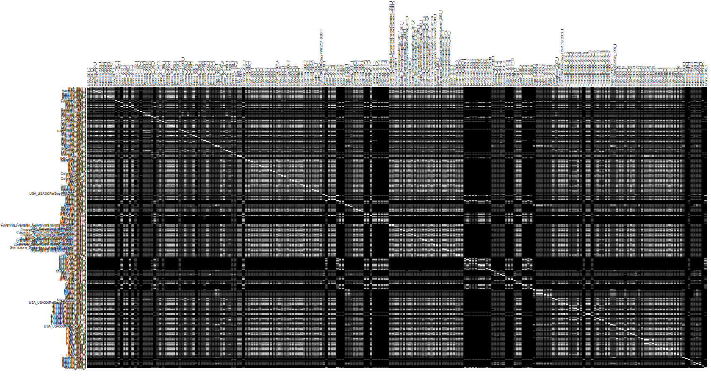
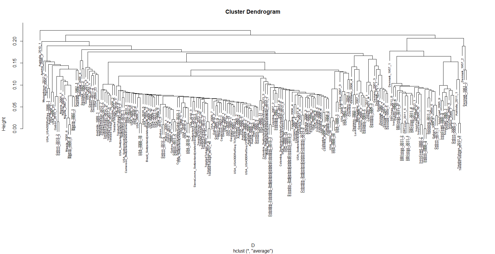
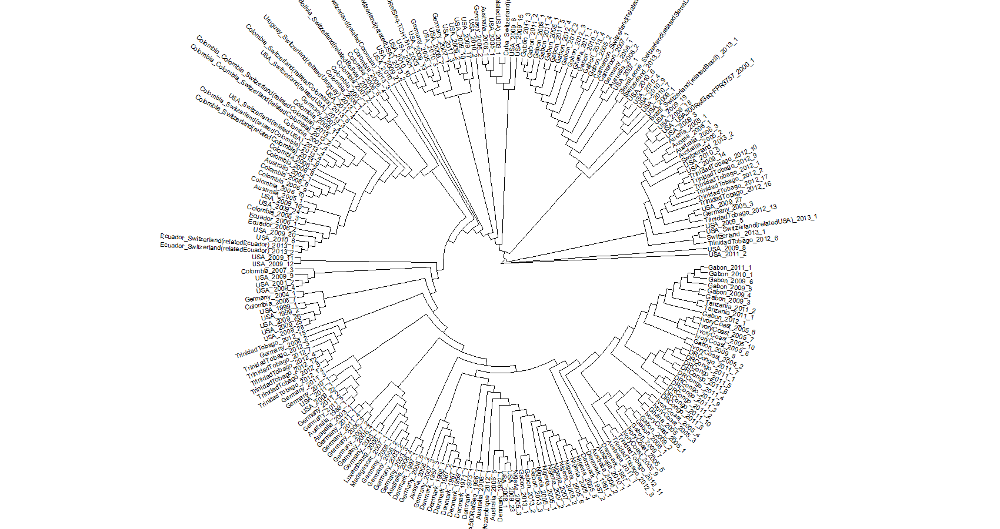
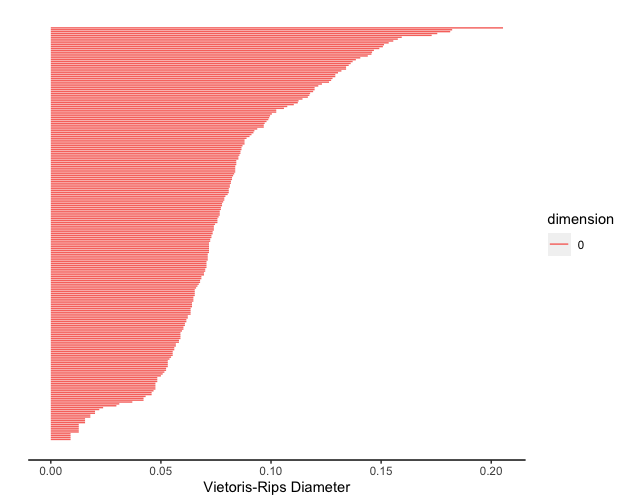

```{r,echo=FALSE}
# paste your file path to the project here in the setwd() function as I have below
# you can copy/paste this code into your console and run it to easily set your
# working directory to wherever you have stored the clone of the repository

# Basic RMarkdown libraries
library("markdown")
library("rmarkdown")
library("bookdown")
library("knitr")

# setwd("I:/My Drive/Spring 2022/MAT 124/midterm2/MAT-124-MRSA-Project")
```

```{r,message=FALSE,echo=FALSE,warning=FALSE}
# libraries
library("dplyr")
library("seqinr")
library("adegenet")
library("ape")
library("ggtree")
library("DECIPHER")
library("viridis")
library("ggplot2")
 
```

```{r, echo=FALSE, warning=FALSE, message=FALSE}
# ~~~~~~~~~~~~~~~ phylogenetic tree creation ~~~~~~~~~~~~~~~~

# read in the aligned data
mrsa <- read.alignment("mrsa_aligned.fasta", format = "fasta")

# create a distance matrix for the alignment
D <- dist.alignment(mrsa, matrix = "similarity")
dist_df <- as.data.frame(as.matrix(D))

# this uses the neighbor joining method (not MLE)
# i.e. Saitou and Nei (1987)
tre_nj <- ape::nj(D)

# This function reorganizes the internal structure of the tree 
# to get the ladderized effect when plotted.
tre_nj <- ladderize(tre_nj) 
```

# Abstract

In this study we examine the evolution of community-acquired methicillin-resistant Staphylococcus *aureus* (CA-MRSA), an antibiotic resistant form of the common bacteria Staphylococcus aureus. Of particular interest, is the lineage of a hypervirulent, pandemic clone of the bacteria which has been spreading globally. First discovered in the United States in the early 2000's, as a new kind of MRSA which was no longer unique to healthcare environments started gaining prominence, the CA-MRSA clone was aptly named USA300. USA300 is of a certain type of S. *aureus* known as multilocus sequence type 8, henceforth referred to as ST-8. We examine the genetic similarity and evolution of 224 isolates of ST-8 type S. *aureus* in order to gain insight into the background and spread of USA300 and related CA-MRSA clones.

# Introduction

Although the ST8 or USA300 strain of CA-MRSA can be found in many regions of the world, it differs greatly in it's overall epidemiology. For example, although ST8 is a commonly known strain of CA-MRSA within a European population, but it is not directly associated with USA300. Additionally, although USA300 has been introduced in Europe on multiple occasions, it does not seem to spread in their general population. If we shift our focus to Asia, although ST8 is considered to be a rare strain in the region, a clone called CA-MRSA/J has sparked recent attention for evolving from a Japanese HA-MRSA, as opposed to USA300. In South America, USA300 was first identified in 2006, although research brought forward the fact that this strain differed in molecular structure compared to the USA300 strain found in North America in the year 2000. It is currently known that the North and South American variants of USA300 are part of a lineage  (USA300-NAE and USA300-SAE) that both arose from a common ancestor approximately 40 years ago. The geographic origin and ancestor is still not known. With so many broken pieces of the puzzle in regards to the origin and evolution of USA300, a 2017 study decided to perform genome sequencing to represent the diversity of ST8 over time, and isolate 12,403 single nucleotide polymorphisms (SNP's), to represent the evolution of USA300 using methods such as maximum likelihood and Bayesian statistics. In our research, we wanted to replicate these results from the 2017 study, to see whether we would get similar results in terms of the phylogenetic tree and maximum clade tree that the study had originally published.

# Methods and Results

## Multiple Sequence Alignment & Phylogenetic Tree Analysis

In our analysis of the phylogeny of ST-8, we use the same data as in @mainpaper on 224 strains of the CA-MRSA bacteria. The authors had already performed alignment "against the chromosome of the S.*aureus* TCH1516 ST8 reference genome (GenBank accession no. CP000730)." They accomplished this using the Burrows-Wheeler Aligner. Thus, we did not have an unaligned data set with which to perform the alignment, however in the course of creation of a phylogenetic tree in R, we did need to a run a function **AlignSeqs()**, from the "DECIPHER" package. This function uses the profile-to-profile alignment method. Since our sequences were already aligned, it did not appear to make any unnecessary changes to our data.

We then used R software along with the packages "seqinr", "adegenet", "ape", "DECIPHER", "viridis", "ggtree", and "ggplot2" to read/write the necessary FASTA files, calculate distances, cluster and visualize our data with guidance from a github repository authored by @github. In doing so we attempt to recreate the results found by @mainpaper. 

In @mainpaper , the authors used the BEAST v1.8.2 software to perform their phylogenetic analysis and build their trees using Bayesian Maximum Likelihood methods. Due to budget-constraints and lack of training, we are not able to use the same software/methods as the paper, but were able to obtain similar results using the method outlined by @github . 

In our study, after we cleaned our data and wrote the necessary files to read the sequences as an "alignment" object, we used the function seqinr::dist.alignment() to create a distance matrix for the aligned sequences. This distance matrix contains the squared root of the pairwise distance between each sequence. It can be visualized in Figure \@ref(fig:dist) .

```{r dist, fig.cap='Distance Matrix: darker grey is more distant', echo=FALSE,warning=FALSE,out.width='100%',out.height='100%'}

```

We then used the ape::nj() function, which performs the neighbor-joining tree estimation of @snei . Given an $n \times n$ distance matrix $D$, its **neighbor-joining matrix** is the matrix $D^*$ defined as

$$ D^*_{i,j} = (n-2)\cdot D_{i,j} - TotalDistance_D(i) - TotalDistance_D(j) $$,
where $TotalDistance_D(i)$ is the sum of distances from $i$ to all other leaves.

Using this method, we create a horizontal, rooted phylogram in figure \@ref(fig:phyloHoriz) and a circular, unrooted phylogram in figure \@ref(fig:phyloCircle) , similar to those found in Fig 1 and Fig 2 of @mainpaper . While the trees are not identical, we see that the general groupings are the same. We see that African isolates are unique in that they are mostly in a grouping of their own. We also see the same trend of European and Australian isolates being peppered in across the entire tree. There is also a distinct separation for South American isolates, indicating the distinction between the North American USA300 (USA300-NAE) and South American USA300 (USA300-SAE) which was highlighted in @mainpaper . 

```{r phyloHoriz, fig.cap='Phylogram', echo=FALSE,warning=FALSE,out.width='100%',out.height='100%'}

```

```{r phyloCircle, fig.cap='Phylogram', echo=FALSE,warning=FALSE,out.width='100%',out.height='100%'}

```

## Topological Data Analysis

In order to perform Topological Data Analysis, we used R Studio to find homologies that were based off of the pairwise distances of the genome sequences from our research paper. With the use of the calculateHomology() function in R, we set the dimensions equal to 1, threshold to -1 and format to 'distmat'. Lastly, we set standardization to false. These 4 parameters were used in the calculateHomology() function and stored inside a variable. The final step was to pass the variable we had created inside a function called plot_barcode(), which then returned a barcode, Figure \@ref(fig:TDAbarcode) . This barcode was then to be used to extract meaningful information, given our hope that the loops, holes and voids that were plotted in the plane had the potential of documenting data that couldn't otherwise be extracted. In our case, we found that  

```{r TDAbarcode, fig.cap='TDA', echo=FALSE,warning=FALSE,out.width='100%',out.height='100%'}

```

# Discussion

# Author Contribution

# References


