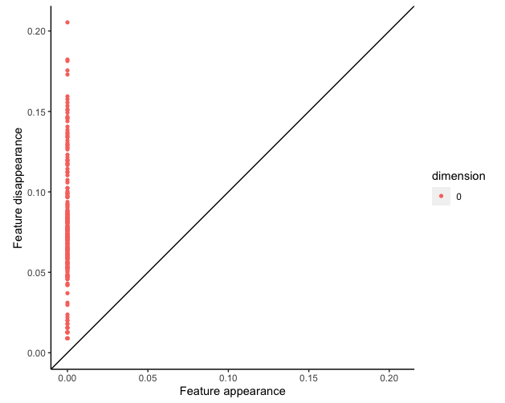

```{r,echo=FALSE}
# paste your file path to the project here in the setwd() function as I have below
# you can copy/paste this code into your console and run it to easily set your
# working directory to wherever you have stored the clone of the repository

# Basic RMarkdown libraries
# library("markdown")
# library("rmarkdown")
# library("bookdown")
# library("knitr")

# setwd("I:/My Drive/Spring 2022/MAT 124/midterm2/MAT-124-MRSA-Project")
```

# Abstract

In this study we examine the evolution of community-acquired methicillin-resistant *Staphylococcus aureus* (CA-MRSA), an antibiotic resistant form of the common bacteria *Staphylococcus aureus*. Of particular interest, is the lineage of a hypervirulent, pandemic clone of the bacteria which has been spreading globally. First discovered in the United States in the early 2000's, as a new kind of MRSA which was no longer unique to healthcare environments started gaining prominence, the CA-MRSA clone was aptly named USA300. USA300 is of a certain type of *S. aureus* known as multilocus sequence type 8, henceforth referred to as ST-8. We examine the genetic similarity and evolution of 224 isolates of ST-8 type *S. aureus* in order to gain insight into the background and spread of USA300 and related CA-MRSA clones.

# Introduction

Although the ST8 or USA300 strain of CA-MRSA can be found in many regions of the world, it differs greatly in it's overall epidemiology. For example, although ST8 is a commonly known strain of CA-MRSA within a European population, but it is not directly associated with USA300. Additionally, although USA300 has been introduced in Europe on multiple occasions, it does not seem to spread in their general population. If we shift our focus to Asia, although ST8 is considered to be a rare strain in the region, a clone called CA-MRSA/J has sparked recent attention for evolving from a Japanese HA-MRSA, as opposed to USA300. In South America, USA300 was first identified in 2006, although research brought forward the fact that this strain differed in molecular structure compared to the USA300 strain found in North America in the year 2000. It is currently known that the North and South American variants of USA300 are part of a lineage  (USA300-NAE and USA300-SAE) that both arose from a common ancestor approximately 40 years ago. The geographic origin and ancestor is still not known. With so many broken pieces of the puzzle in regards to the origin and evolution of USA300, a 2017 study decided to perform genome sequencing to represent the diversity of ST8 over time, and isolate 12,403 single nucleotide polymorphisms (SNP's), to represent the evolution of USA300 using methods such as maximum likelihood and Bayesian statistics. In our research, we wanted to replicate these results from the 2017 study, to see whether we would get similar results in terms of the phylogenetic tree and maximum clade tree that the study had originally published. In additon to the figures brought forward by the authors, we also decided to perform Topical Data Analysis to see whether we could draw any deeper trends in addition to their research.

# Methods and Results

## Multiple Sequence Alignment & Phylogenetic Tree Analysis

In our analysis of the phylogeny of ST-8, we use the same data as in @mainpaper on 224 strains of the CA-MRSA bacteria. The authors had already performed alignment "against the chromosome of the *S. aureus* TCH1516 ST8 reference genome (GenBank accession no. CP000730)." They accomplished this using the Burrows-Wheeler Aligner. Thus, we did not have an unaligned data set with which to perform the alignment, however in the course of creation of a phylogenetic tree in R, we did need to a run a function **AlignSeqs()**, from the "DECIPHER" package. This function uses the profile-to-profile alignment method. Since our sequences were already aligned, it did not appear to make any unnecessary changes to our data.

We then used R software along with the packages "seqinr", "adegenet", "ape", "DECIPHER", "viridis", "ggtree", and "ggplot2" to read/write the necessary FASTA files, calculate distances, cluster and visualize our data with guidance from a github repository authored by @github. In doing so we attempt to recreate the results found by @mainpaper. 

In @mainpaper , the authors used the BEAST v1.8.2 software to perform their phylogenetic analysis and build their trees using Bayesian Maximum Likelihood methods. Due to budget-constraints and lack of training, we are not able to use the same software/methods as the paper, but were able to obtain similar results using the method outlined by @github . 

In our study, after we cleaned our data and wrote the necessary files to read the sequences as an "alignment" object, we used the function seqinr::dist.alignment() to create a distance matrix for the aligned sequences. This distance matrix contains the squared root of the pairwise distance between each sequence. It can be visualized in Figure \@ref(fig:dist) .

```{r dist, fig.cap='Distance Matrix: darker grey is more distant', echo=FALSE,warning=FALSE,out.width='100%',out.height='100%'}

```

We then used the ape::nj() function, which performs the neighbor-joining tree estimation of @snei . Given an $n \times n$ distance matrix $D$, its **neighbor-joining matrix** is the matrix $D^*$ defined as

$$ D^*_{i,j} = (n-2)\cdot D_{i,j} - TotalDistance_D(i) - TotalDistance_D(j) $$,
where $TotalDistance_D(i)$ is the sum of distances from $i$ to all other leaves.

Using this method, we create a horizontal, rooted phylogram in figure \@ref(fig:phyloHoriz) and a circular, unrooted phylogram in figure \@ref(fig:phyloCircle) , similar to those found in Fig 1 and Fig 2 of @mainpaper . While the trees are not identical, we see that the general groupings are the same. We see that African isolates are unique in that they are mostly in a grouping of their own. We also see the same trend of European and Australian isolates being peppered in across the entire tree. There is also a distinct separation for South American isolates, indicating the distinction between the North American USA300 (USA300-NAE) and South American USA300 (USA300-SAE) which was highlighted in @mainpaper . 

```{r phyloHoriz, fig.cap='Phylogram', echo=FALSE,warning=FALSE,out.width='100%',out.height='100%'}
knitr::include_graphics("figures/phyloHoriz.png")
```

```{r phyloCircle, fig.cap='Phylogram', echo=FALSE,warning=FALSE,out.width='100%',out.height='100%'}
knitr::include_graphics("figures/phyloCircle.png")
```

## Topological Data Analysis

In order to perform Topological Data Analysis, we continued our analysis in R to find homologies that were based off of the pairwise distances of the genome sequences from our research paper. Based of the Distance Matrix we created as shown in Figure \@ref(fig:dist), we used the calculateHomology() function in R within the "TDAstats" package in order to calculate the homologies of our sequences dataset. Within the function, we set the dimensions equal to 1, threshold to -1, format to 'distmat', and standardization to false. We then used the function plot_barcode(), which then returned a barcode graph, seen in Figure \@ref(fig:TDAplots) (left). Further, we used the function plot_persist() to provide additional clarification on our topological data analysis as seen in Figure \@ref(fig:TDAplots) (right).


```{r TDAbarcode, eval=FALSE,fig.cap='TDA', echo=FALSE,warning=FALSE,out.width='100%',out.height='100%'}
# LEGACY

```

```{r TDApersist, eval=FALSE, fig.cap='TDA', echo=FALSE,warning=FALSE,out.width='100%',out.height='100%'}
# LEGACY

```

```{r TDAplots, fig.cap='Barcode Plot (left) and persistance plot (right)', fig.show = 'hold', fig.align = 'center', echo=FALSE,warning=FALSE,out.width='49%',out.height='65%'}
knitr::include_graphics(c("figures/TDAbarcode.png", "figures/TDApersist.png"))
```

Topological Data Analysis is a way to see the ancestral paths of our dataset. For the barcodes, we can see a similar pattern in our data as we can see in the phylogenetic analysis portion. The barcode graph shows a lot of similarity in strains as shown by the small difference in length for the middle region of the graph. This implies that our strains underwent a lot of genetic variation in a short period of evolutionary time, since we see a lot of the strains have a similarly lengthed bar. This same relationship is apparent in the persist graph in Figure \@ref(fig:TDAplots) (right). We can see a lot of data points almost form a solid line between 0.05 and .10 on the y-axis. With that being said, our evolutionary relationship makes sense, because in @mainpaper, they reference that the strains in Africa are all quite similar in genetic information.

More importantly, we can see that there is a very large difference from the youngest strain and the oldest strain by the length of their bar on the Vietoris-Rips Diameter graph in Figure \@ref(fig:TDAplots) (left). We see that the youngest strain is roughly 0.01 in length and the oldest strain is more than 0.20 in length. This can be seen in the Phylogenetic tree in Figure \@ref(fig:phyloCircle) as USA_2011_2 compared to Gabon_2011_1. Since the timestamp is indicated, this becomes clear that the oldest strain in evolution is not necessarily the same as the oldest strain in chronology of discovery. Our Topological Data Analysis shows a lot of variation in the middle region of evolutionary time and the biggest evolutionary difference is between two strains which were discovered in the same year..

# Discussion

The phylogenies that were produced by the authors of our chosen paper showed that ST8 must have originated from Central Europe while USA300 originated somewhere in North America. In addition to this, there was a clear distinction between the USA300 strain as it was separated into two distinct lineages (USA300-NAE and USA300-SAE) with one being the North American Variant, and the other being the South American Variant. It was also estimated that both the North and South American variants of USA300 shared a common ancestor approximately 50 years ago. With so many differing strains identified over the last century, the author's of the paper were able to make a few key claims based on their results. First, the USA300 strain is unlikely to have evolved from a strain known as USA500 which is known to have circulated in Europe approximately 100 years ago. Similarly, the evolution of ST8 CA-MRSA in Western Australia Trinidad and Tobago as well as West Africa were not supported by data the that was collected. Instead, the origin of the North and South American variants of USA300 is hypothesized to have taken a longer route in it's ancestral history. The story told by the data claims that the USA300 strains in both North and South America likely share an ancestor known as PVL-Positive MSSA. On the other hand, PVL-Negative ST8 was imported from Europe in the 20th century with the influx of emigration to the US due to war, economic crises and prosecution. Our own analysis of ST8 as well as the analysis of the authors agreed on the fact that the ST8 strain has many isolates in regions such as Europe, Australia and Asia, with minimal clustering of closely relates isolates. This tells us that the ST8 strain depending on the region was shaped by some degree of it's ancestral traits as well as genetic traits that were brough forth by it's environment. Many of the populations that exist around the globe today are a result of derived traits that likely came about with the purpose of better adapting to their respective regions. Our final conclusion then becomes that although ST8 and USA300 likely originated from some common ancestor many centuries ago, the environment has had a major impact in shaping it's genetic makeup, branching into more and more variants and increasing genetic diversity as a result of evolution. Through the phylogenetic tree that we produced, we were able to find many similarities in the way our strains clustered together as we focused on any given region. This was especially apparent as we moved towards the bottom of the phylogenetic tree where some of the newer strains became more genetically similar, and were hence on the same branch. As a part of our TDA Analysis, we replotted each of the 224 strains that were studied in the original paper. Each strain in our case represented a single bar. After our figure was generated, we started seeing a trend with the way our bars start disappearing as we moved up and right on the plotted graph. This tells us that some of our strains were very similar and hence merged into a single strain. The key takeaway from this figure was that, all of the 224 strains that we studied started from one ancestor, after which there were some major evolutionary events that occurred. After these major events, we started seeing lots of clustering events which tell us that although we have many new strains that branched from a common ancestor, the newer strains are far more genetically similar as compared to their ancestors that may have undergone larger genetic changes. As time passes, we expect to see the number of strains present in the environment to increase, but we also expect them to have lesser genetic differences between them.

# Author Contribution

# References

<div id="refs"></div>

# (APPENDIX) Code Appendix {-}

## Data Cleaning

```{r, eval=FALSE}
# Here we took the data from the format we were given and 
# turned it into a data frame (before we learned which packages to use and how to use them). 
# We were told to create a database as part of the assignment so 
# this is the one we created, although we didn't end up using it in this form.

# read in the data
library(readr)
pnas_1702472114_sd04 <- read_delim("pnas.1702472114.sd04.txt", 
    delim = ">", escape_double = FALSE, trim_ws = TRUE)
View(pnas_1702472114_sd04)

#~~~~ clean the data ~~~~~~~~~

# create/names for dataframe mrsa
mrsa <- data.frame(cbind(pnas_1702472114_sd04[2],pnas_1702472114_sd04[1]))
mrsa[1,1] <- "USA_2001_2"
colnames(mrsa) <- c("strain","sequences")

#align sequences with their strains
for (i in 2:length(mrsa$sequences)) {
  if (i %% 2 == 0){
    mrsa$sequences[i] <- mrsa$sequences[i+1]
  }
}

# remove extra copies of sequences corresponding to NA strains
# (need to remove odd rows from data frame after row 2)
mrsa <- mrsa %>% filter(mrsa$strain != "NA")
```

## MSA & Phylogenetic Tree

```{r, eval=FALSE}
library(seqinr)
library(adegenet)
library(ape)
library(ggtree)
library(DECIPHER)
library(viridis)
library(ggplot2)

# setwd("I:/My Drive/Spring 2022/MAT 124/midterm2/MAT-124-MRSA-Project")

# load sequences
seqs <- readDNAStringSet("pnas.1702472114.sd04.txt", format = "fasta")

#look at some of the sequences
seqs

#view (aligned) sequences in a browser
BrowseSeqs(seqs, highlight = 0)

# perform alignment
# (ours are already aligned? but not of class alignment,
# wich is required as input for dist.alignment() function)
# i guess if they are already aligned nothing will change?
seqs_aligned <- AlignSeqs(seqs)

# compare to previous sequences in browser
# (looks the same)
BrowseSeqs(seqs_aligned, highlight = 0)

# write the alignment to a new FASTA file
# (maybe could have started here?)
writeXStringSet(seqs_aligned, file = "mrsa_aligned.fasta")

# read in the aligned data
mrsa <- read.alignment("mrsa_aligned.fasta", format = "fasta")

# create a distance matrix for the alignment
D <- dist.alignment(mrsa, matrix = "similarity")
dist_df <- as.data.frame(as.matrix(D))

# darker shades of gray mean a larger distance 
# you can also make cool color plots 
# but they're much more complicated because they use the image() function
table.paint(dist_df, cleg=0, clabel.row=.5, clabel.col=.5)+
  scale_color_viridis()

# this uses the neighbor joining method (not MLE)
# i.e. Saitou and Nei (1987)
tre_nj <- ape::nj(D)

# all trees created using {ape} package will be of class phylo
class(tre_nj) 

# This function reorganizes the internal structure of the tree 
# to get the ladderized effect when plotted.
tre_nj <- ladderize(tre_nj) 

# ~~~~~~~~~~~~~~~~~~~~~~ Base R plots ~~~~~~~~~~~~~~~~~~~~~~~~~~~~~~~~~~~
plot(tre_nj)

# method = average is used for UPGMA, 
# members can be equal to NULL or a vector with a length of size D
h_cluster <- hclust(D, method = "average", members = NULL) 
plot(h_cluster, cex = 0.6)
# =======================================================================

# ~~~~~~~~~~~~~~~~~~~~~~ Using ggtree ~~~~~~~~~~~~~~~~~~~~~~~~~~~~~~~~~~~

# circular layout (hard to read)
ggtree(tre_nj, layout = "circular")+
  geom_tiplab(size = 3)

# circular unrooted layout (easier to read)
ggtree(tre_nj,branch.length = "none", layout = "circular")+
  geom_tiplab(size = 3)

# Cladogram: rectangular layout
ggtree(tre_nj, branch.length = "none")+
  geom_tiplab(size = 3)

# top-down rectangular layout (Dendrogram)
ggtree(tre_nj)+ 
  layout_dendrogram()
```

## Topological Data Analysis

```{r, eval=FALSE}
#                       Header material (setup)
# =====================================================================
# Package Installation:
# Use the commands:
# install.packages("BiocManager")
# BiocManager::install("Biostrings")
# BiocManager::install("RSQLite")
# BiocManager::install("DECIPHER")
# install.packages("TDAstats")
library(BiocManager)
library(Biostrings)
library(RSQLite)


# Packages used
library(seqinr)
library(adegenet)
library(ape)
library(ggtree)
library(DECIPHER)
library(RSQLite)
library(viridis)
library(ggplot2)
library(BiocManager)
library(Biostrings)
library(RSQLite)
library(TDAstats)

# TDA package
# install.packages("TDAstats")

#                       Beginning of Code (setup)
# =====================================================================
# load sequences
seqs <- readDNAStringSet("pnas.1702472114.sd04.txt", format = "fasta")

#look at some of the sequences
seqs

#view (aligned) sequences in a browser (uncomment to browse)
# BrowseSeqs(seqs, highlight = 0)

# perform alignment (if necessary)
seqs_aligned <- AlignSeqs(seqs)

# compare to previous sequences in browser (uncomment to browse)
# BrowseSeqs(seqs_aligned, highlight = 0)

# write the alignment to a new FASTA file
writeXStringSet(seqs_aligned, file = "mrsa_aligned.fasta")

#                       DISTANCE MATRIX + TDA
# =====================================================================
# read in the aligned data
mrsa <- read.alignment("mrsa_aligned.fasta", format = "fasta")
mrsa

# create a distance matrix for the alignment
D <- dist.alignment(mrsa, matrix = "similarity")
dist_df <- as.matrix(D)

# The dist_df variable now contains the distance matrix in R. 
# To find the homologies, we use the following commands: 
p <- calculate_homology(dist_df, dim =1, threshold = -1, format = "distmat", standardize = FALSE, return_df = FALSE)

# Plot the TDA graphs
plot_barcode(p)
plot_persist(p)
```


